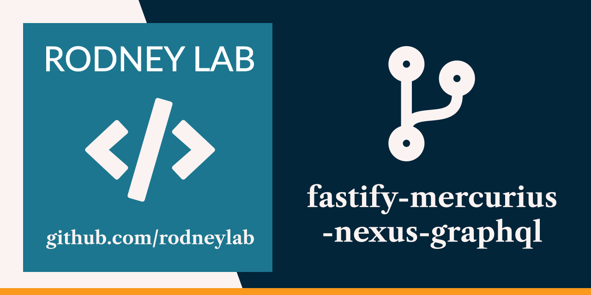

<p align="center">
  <a aria-label="Open Rodney Lab site" href="https://rodneylab.com" rel="nofollow noopener noreferrer">
    
  </a>
</p>
<h1 align="center">
  Fastify Mercurius Nexus GraphQL
</h1>

# fastify-mercurius-nexus-graphql

Demo for Node GraphQL API using Fastify, TypeScript, Mercurius and Nexus. The
code accompanies the
<a aria-label="Open Rodney Lab blog post on using Fastify Graph Q L A P I Stack" href="https://rodneylab.com/fastify-graphql-api-stack/">article
on Fastify GraphQL API Stack</a>. If you have any questions, please drop a
comment at the bottom of that page.

# GraphQL API demo using Fastify, Mercurius and Nexus

## Run Development Server

Copy `.env.dev.EXAMPLE` and `.env.test.EXAMPLE` to `.env.dev` and `.env.test`
and update `docker-compose.yml` with your own credentials.

```shell
pnpm run dev
```

To test a GraphQL query, navigate to
[http://localhost:4000/graphiql](http://localhost:4000/graphql) in your browser.

## Run Tests

Stop the dev server then run

```shell
pnpm test
```

You can add additional tests under the `tests` folder.

## Test queries

### Queries

```graphql
{
	drafts {
		id
		title
		body
		published
	}
}
```

```graphql
query {
	posts {
		id
		title
		body
		published
	}
}
```

### Mutations

```graphql
mutation {
	createDraft(title: "Nexus", body: "...") {
		id
		title
		body
		published
	}
}
```

```graphql
mutation {
	deleteDraft(draftId: 1)
}
```

```graphql
mutation {
	publish(draftId: 1) {
		id
		title
		body
		published
	}
}
```

Feel free to jump into the
[Rodney Lab matrix chat room](https://matrix.to/#/%23rodney:matrix.org).
